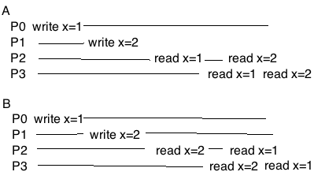
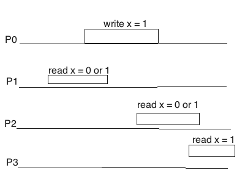
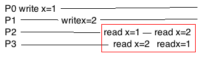
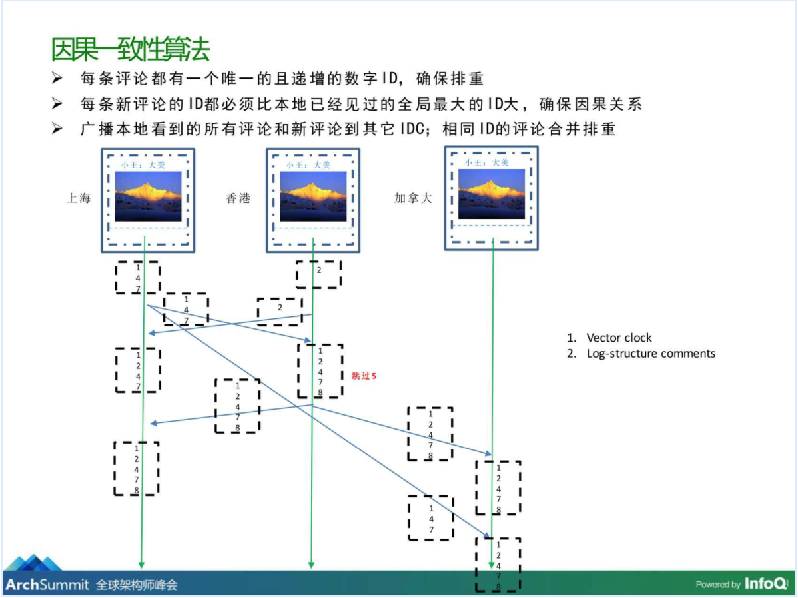

# 一致性模型

## 什么是一致性模型

一致性模型是分布式领域内描述系统状态的一个概念，不同的一致性模型对系统有不同的要求。

我们常说的一致性有：

* 强一致性：当更新操作完成之后，任何多个后续进程或者线程的访问都会返回最新的更新过的值。这种是对用户最友好的，就是用户上一次写什么，下一次就保证能读到什么。根据 CAP 理论，这种实现需要牺牲可用性。
* 弱一致性：系统并不保证续进程或者线程的访问都会返回最新的更新过的值。系统在数据写入成功之后，不承诺立即可以读到最新写入的值，也不会具体的承诺多久之后可以读到。
* 最终一致性：弱一致性的特定形式。系统保证在没有后续更新的前提下，系统最终返回上一次更新操作的值。在没有故障发生的前提下，不一致窗口的时间主要受通信延迟，系统负载和复制副本的个数影响。DNS 是一个典型的最终一致性系统。

## 有哪些一致性模型

下面是一个例子：

```
User0-----------------|write(x=1)|-----------

User1------|r1(x=0)|----|r2(x=0/1)|-----|r3(x=1)|----

User2-----------|r1(x=0/1)|--|r2(x=0/1)|---|r3(x=1)|--

```
这个例子中，User1和User2最终都会读取到x=1，满足最终一致性的要求。

但是可能会出现以下的情况：

1. User1的r2操作读取到1，User2的r2请求读取到1
2. User1的r2操作读取到1，User2的r2请求读取到0

虽然满足最终一致，系统对外的表现上，以上的两种状态显然是不同的。

情况2中，数据x出现了回跳，即出现了读到1之后，又读到了变更之前的0。

从数据的视图上（从系统外部看我们读到的数据的状态），可以把一致性模型细分为：

* 严格一致
* 线性一致
* 顺序一致
* 因果一致
* ...(更弱的一致性就不考虑了)

### 严格一致（Strict Consistency）

严格一致是最强的一致性模型，需要满足如下的要求：

* 任何一个写操作完成后需要对所有的进程立即可见

根据CAP的原理，这个一致性模型在没有牺牲可用性的前提下是不能得到满足的。
（性能也是不可接受的：所有的写操作需要同步到所有节点之后再返回给客户端）

### 线性一致（Linearizability Consistency）

线性一致性有时候也称为强一致性，是可以实现的最高一致性模型，需要满足两个条件：

* 任何一次读都能读到最近一次写的结果
* 所有进程看到操作顺序都和全局时钟下的顺序一致



对于这个例子来说，A就是满足线性一致的，B是不满足线性一致的。因为读取到x = 2、x = 1的顺序和全局时钟下写入时的顺序是不一致的。



对于上面这种操作有重叠的情况，实际上他们是并行的，线性一致性要求不管是否并行的事件，所有的进程看到的顺序是一致的（因为是并行的，可以认为全局始终下的顺序也是不确定的，所以进程间满足重叠部分的顺序一致即可）。

即一下情况满足线性一致性：

1. w1 r1 r1 r1（P0->P1->P2->P3或P0->P1->P3->P2）
2. r0 w1 r1 r1（P1->P0->P2->P3或P1->P0->P3->P2）
3. r0 r0 w1 r1（P1->P2->P0->P3）

### 顺序一致（Sequential Consistency）

顺序一致比线性一致要弱一些，需要满足：

1. 任何一次读操作都能读取到最近一次写操作的结果
2. 所有进程看到的顺序是一致的，但是并不要求和全局时钟下的顺序一致

如下图：


A和B两种情况都满足顺序一致性。

P0和P1是两个并发操作的进程，所以A、B两种情况，分别对应P0先执行和P1先执行的情况。

（可以把顺序一致性理解为将并发操作按照某一种顺序执行，在所有的进程上看到的这个顺序是一致的）



上面这个图，无论将并发的P0、P1操作怎么排序，在P2和P3上看到的顺序都是都是不一致的，所以不满足顺序一致性。

### 因果一致（Causal Consistency）

因果一致性比顺序一致性的要求更弱一些，仅要求有因果关系的操作顺序性得到保证，非因果关系的操作顺序性没有要求（即不需要所有进程看到的顺序是一致的）。

具体如下：

1. 本地顺序：统一进程中，事件的执行顺序即为本地的因果顺序
2. 异地顺序：如果读操作返回的是写操作的值，那么该写操作一定在读操作之前
3. 闭包传递：如果a->b，b->c，那么a->c



上面是微信朋友圈的因果一致性的例子。